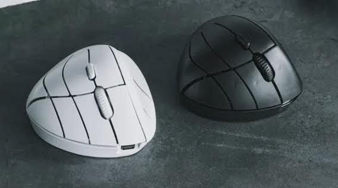

# Snugon MO1

Snugon MO1 is an innovative multi-button mouse designed by Snugon.

## About Snugon MO1
Snugon MO1 is an innovative ergonomic mouse designed with unique button placement for all five fingers, significantly improving intuitive control and accuracy. Its 12 programmable buttons, combined with powerful layering functions powered by QMK firmware, enable users to execute over 60 customizable commands effortlessly, revolutionizing productivity and workflow efficiency.

## Where to Buy

* Makuake: <https://www.makuake.com/project/snugon-mo1/>

## Useful Links

* Snugon's brand site: <https://snugonshop.meihonet.co.jp/>
* Snugon's blogs: <https://snugonshop.meihonet.co.jp/blogs/blogs>
* User Manual: <https://snugonshop.meihonet.co.jp/pages/manual-main>